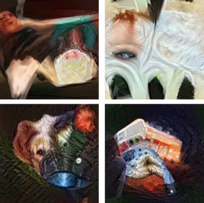

# Incremental Learning in Semantic Segmentation 

`Abstract`: One of the biggest challenges in Deep Learning is to avoid the loss of past knowledge when new classes appear. This phenomenon is known as catastrophic forgetting and there is an ongoing debate on how to overcome this concern. In this paper we faced this problem in the context of semantic segmentation, where another relevant issue is the background shift. At every incremental step the background semantic considers all the classes that are not present in the current step, even the ones learned before or the ones that will be learned in the next steps. In order to tackle these is- sues, we started from the ”`Modeling the Background`” protocol, using the `BiSeNet` architecture for the semantic segmentation task, which preserves the spatial information and generates high-resolution features. Moreover, in order to refresh the past knowledge, we used new synthetic images generated through `Deep Inversion` from the past incremental steps. It optimizes random noise into a class conditional image with a pre-trained CNN and it improves its sparsity through a competition scheme with a weaker student net- work. All the experiments have been performed on the PASCAL VOC dataset, that contains 20 annotated classes.

* You can find our report [`here`](https://github.com/francescodisalvo05/incremental-learning-semantic-segmentation/blob/main/Di_Salvo_La_Malfa_Lacriola_Report.pdf). 

---

## Run the code
Other than the [arguments](https://github.com/fcdl94/MiB) proposed by the author of MiB (the incremental baseline), we have introduced:

* --deepinversion_images : directory of synthetic images generated through [DeepInversion](https://github.com/francescodisalvo05/DeepInversion) (Only for step > 0)

```
!python run.py --deepinversion_images='..' --data_root='..' --step_ckpt='..' --backbone='resnet50' --task='15-5' --step=1 --batch_size=16 --crop_size=512 --lr=1e-2 --epochs=20
```

## Generated Images
Below you can see the synthetic images of the classes: cow, person, dog and bus. Considering our computational limitations (running on Google Colab), they can be considered quite satisfactory.

<p align="center">
  
</p>

### Main references:
* Modeling the Background protocol, by Cermelli at al [(paper](https://arxiv.org/abs/2002.00718), [code)](https://github.com/fcdl94/MiB)
* BiSeNet by Changqian Yu et al, [(paper](https://arxiv.org/abs/1808.00897), [code)](https://github.com/fcdl94/BiseNetv1)
* Deep Inversion by et al, [(paper](https://arxiv.org/abs/1912.08795), [code)](https://github.com/NVlabs/DeepInversion)
